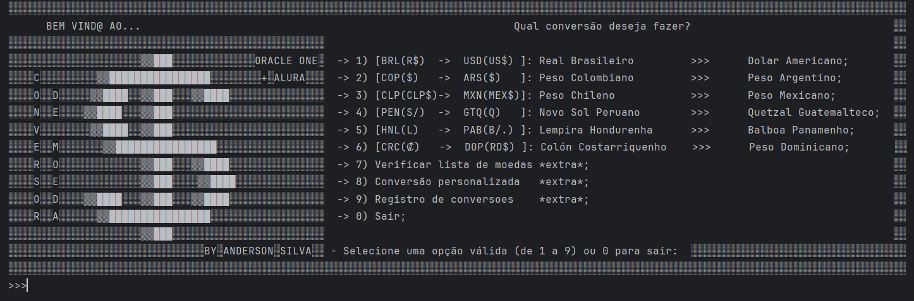
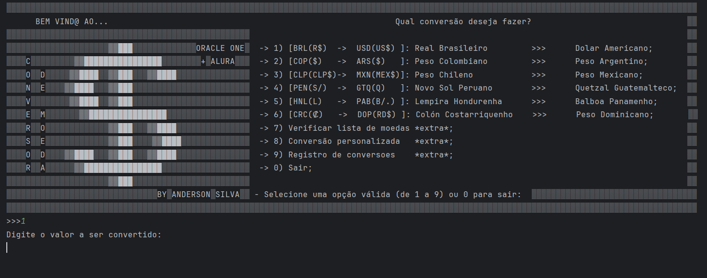
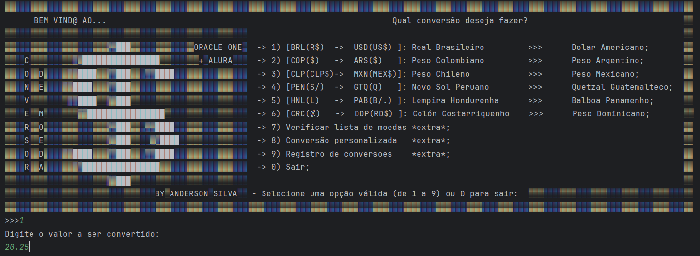
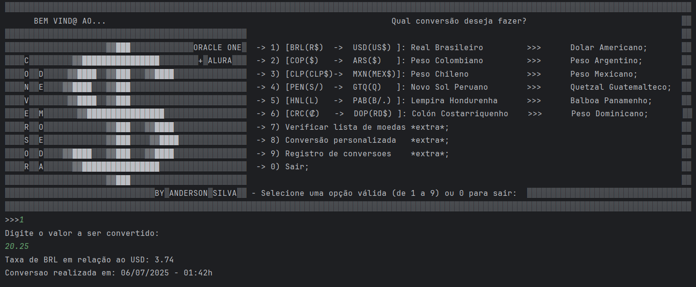
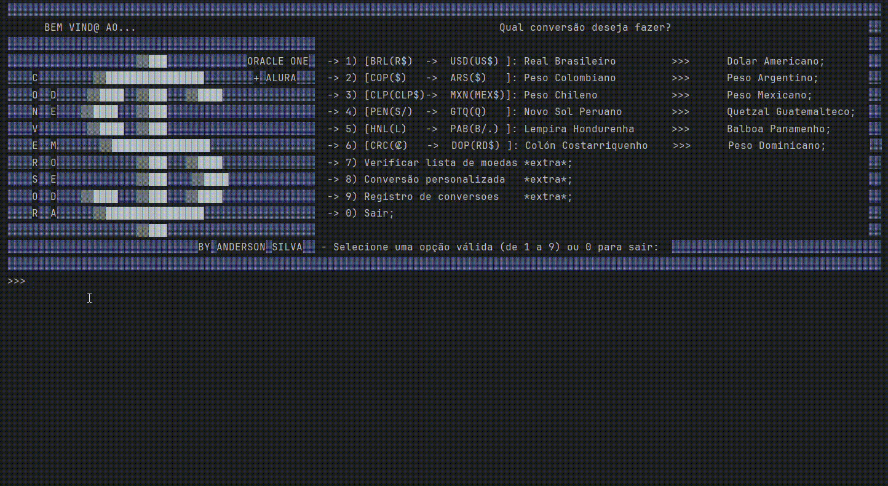

# Challenge - Conversor de moedas

Um programa que interage com o usuário via console para realizar conversões de moedas, utilizando uma API "Extended Rate" para obter cotações em tempo real.

### 🔧 Instalação

Como instalar/testar o projeto?

- Etapa 1:  Clone o projeto do github:

```
git clone https://github.com/AndersonRamos07/Oracle-Next-Education-G8
```
- Etapa 2:  Entre na pasta do projeto "challenge-conversor-moeda":

```
cd Oracle-Next-Education-G8/challenge-conversor-moeda
```
- Etapa 3:  Entre na pasta "src":

```
cd src
```
- Etapa 4: Compile a classe principal:

```
javac Main.java
```
- Etapa 5:  Execute a classe Main:

```
java Main
```

### 🔧 Como usar:

- Selecione a opcao que deseja no menu principal, digitando o numero da opcao e clicando em Enter:



- Digite um valor a ser convertido: (Note que no exemplo foi seleciona a opcao "1")



- Agora digite um valor a ser convertido: (Na imagem abaixo foi digitado um valor aleatorio)



- Clique em Enter e o programa informara o valor convertido com a taxa de cambio:



- Abaixo o exemplo do resultado caso tenha seguido o exemplo acima:



- Agora, seguindo o menu e os passos de "digite a opcao, depois o valor" voce podera utilizar as outras opcoes oferecidas.

## 🛠️ Construído com

* [Java](https://www.java.com/pt-BR/download/help/whatis_java.html) - Java Language
* [Maven](https://maven.apache.org/) - Apache Maven
* [Gson](https://mvnrepository.com/artifact/com.google.code.gson/gson) - Gson (Google)

## ✒️ Autor

Anderson Ramos

---